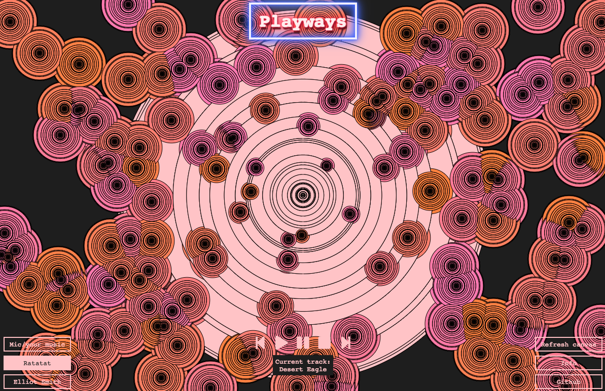

# Playways

[Playways](https://katshaze.github.io/playways) is a music visualiser and generative art app built using the p5 and p5 Sound libraries. Every visualisation created is different.

## How it works
Sound is continually being measured for amplitude and this data is used render circles, as well as cause new circles to be produced when there are big jumps in amplitude.

## Features
* Different visualisations are created for different songs and sounds.
* Toggle between the music of two preloaded artists, as well as 'mic mode', which analyses sounds from the user's environment such as music played through the computer, or the user's own sounds/music
* For the preloaded music, you can play, pause and skip between tracks.
* Refresh the canvas as desired.

## Technologies Used
* p5.js
* p5.sound.js
* Javascript (inc. ES6)
* jQuery
* HTML5 / CSS3
* Parcel bundler

## Lowlands
* The app works best on Chrome on desktop at this stage due to issues loading sound in other browsers.
* Intermittent bugs related to autoplay

## (Massive) todo list
- [ ] User to be able to drag and drop own mp3 to play
- [ ] Connect via API to Spotify, Soundcloud or similar platform to allow user to login and play their music
- [ ] Slider to show progress of songs
- [ ] Take shots of the canvas with different visualisations and save to a gallery

## Acknowledgements
A big thanks to Joel Turnbull, John Coote and James Theo at GA. Also to Daisy Smith for help and inspiration.

## License
Licensed under MIT.
